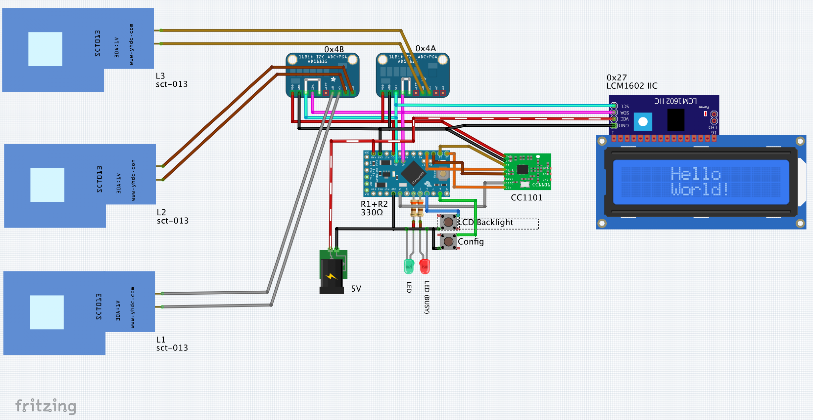
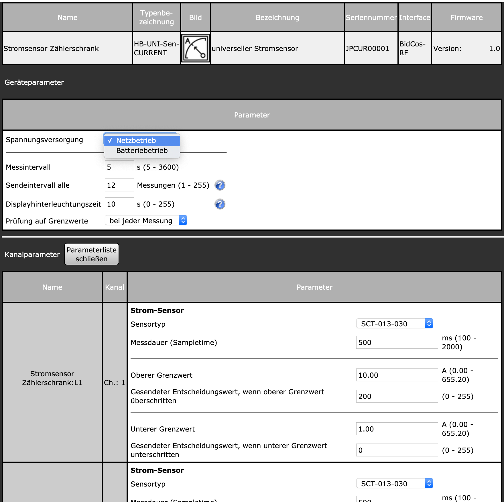
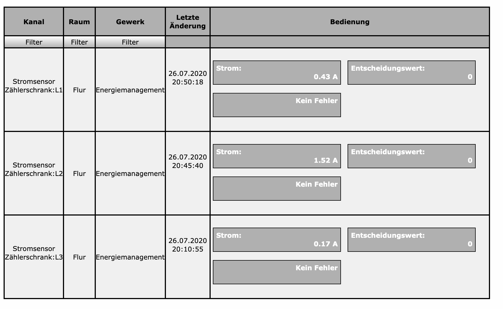

# HB-UNI-Sen-CURRENT

## Universeller Stromsensor für HomeMatic
unterstützt 
 - YHDC SCT013-015; -020; -030; -050; -100 / 1V Sensoren
 - INA219 _(work in progress)_
 - ACS712 _(work in progress)_
 
 ## Beispielprojekt: 3-Phasen Strommessung im Verteilerschrank
 
 
 ## Bauteile
  - 1x Arduino Pro Mini (**8 MHz, 3.3V**) [AliExpress](https://de.aliexpress.com/item/32342672626.html)
  - 1x CC1101 868MHz Funkmodul [AliExpress](https://de.aliexpress.com/item/32924239954.html)
  - 2x ADS1115 16bit ADC [AliExpress](https://de.aliexpress.com/item/32954034047.html)
  - 3x SCT013-030/1V Stromsensor [AliExpress](https://de.aliexpress.com/item/4000189334448.html)
  - 1x 16x2 LCD Display [AliExpress](https://de.aliexpress.com/item/32685612494.html)
  - 2x Taster
  - 2x LED
  - 2x Widerstand 330 Ohm
  - ext. Stromversorgung 5V
 
 ## Schaltungsübersicht
 
 
 ## CCU Einstellungen
 **Geräteeinstellungen**
 - Spannungsversorgung
   - Netzbetrieb
   - Batteriebetrieb (es erscheint dann zusätzlich ein Feld für die Low-Battery Einstellung)
 - Messintervall
 - Sendeintervall
   - Es wird der Mittelwert über die eingestellte Anzahl Messungen gebildet und übertragen. Der zeitliche Sendeabstand beträgt (Messintervall x Sendeintervall) Sekunden
 - Displayhinterleuchtungszeit
   - Dauer der LCD Hintergrundbeleuchtung nach Druck auf Taster 2 (0 = Dauerhaft EIN)
 - Prüfung auf Grenzwerte
   - bei jeder Messung: wird bei einer einzelnen Messung ein Grenzwert über-/unterschritten, wird sofort der Entscheidungswert gesendet
   - Mittelwert: liegt der Mittelwert (s.o.) über/unter einem Grenzwert, wird der Entscheidungswert erst im Sendeintervall gesendet
 
 **Kanaleinstellungen**
  - Sensortyp: Auswahl des verwendeten Sensortyps
  - Messdauer: Dauer der Messung (Mittelwert über n Millisekunden)
  - Oberer / Unterer Grenzwert und Entscheidungswert: hierüber lassen sich direkt verknüpfte Aktoren bei über-/unterschreiten von Grenzwerten schalten
  
 
 
 
 
 ## CCU Bedienung
 Anzeige von aktueller Stromstärke, ggf. zuletzt gesendetem Entscheidungswert sowie Fehler (bei Ausfall eines ADS1115 Moduls)
 
 
